<p align="center">
  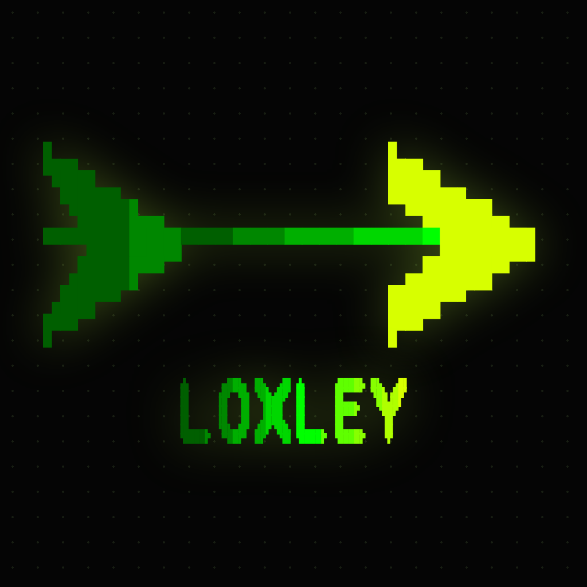
</p>
<p align="center">
  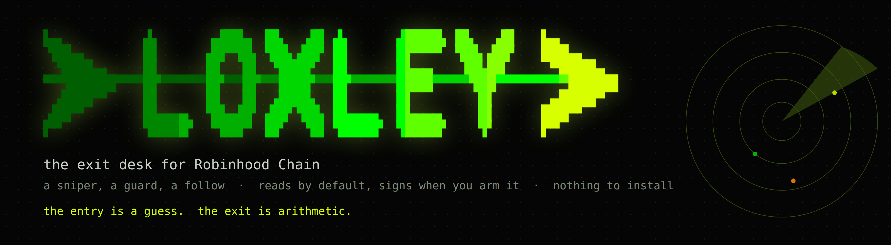
</p>

<p align="center">
  
  
  
  
  
  
  
  
</p>

<!-- the token line, when there is a token: uncomment and paste the contract
<p align="center">
  <b>$LOXLEY</b> · <code>0x0000000000000000000000000000000000000000</code>
</p>
-->

Every pons v2 launch on Robinhood Chain has two doors. The one in, behind a **99 % tax that decays to zero in three
seconds**. And the one out, which is the only one that ever mattered: the curve while it fills, the v4 pool after,
nothing at all in the gap between the sweep and the pool, and, on most launches, a deployer who leaves first.
Loxley reads a launch in one multicall, scores it with rules you can read, fires when the tax is under your ceiling
(on paper until you arm it), and then does the part the entry bots skip: it marks the position with the exact quote
for leaving, every few seconds, and leaves on the rules, on the siren, or **the second the deployer's tokens move**.
Local, open, non-custodial, reads by default. Nothing to install.

The entry is a guess. The exit is arithmetic.

| The problem | What loxley does | Command |
|---|---|---|
| "what is even trading on this chain?" | every token DexScreener lists on Robinhood Chain, its deepest pool, price, moves, liquidity, volume, flow, age, the impact of selling 1 ETH, and the desk's stamp on the pool | `market` |
| twenty-odd thousand launches a day | one multicall per launch: dev buy, creator tax, who gets the fees, socials, the declared bundle, deployer record, launch-farm fingerprint, curve fill, the door, then a 0–100 score with every reason | `hunt` |
| the first second costs 99 % | polls `currentSnipeTaxBps` for **your** address every 150 ms and fires under the ceiling, on paper or signed | `snipe` |
| the deployer sells and you find out on the chart | reads the deployer's `CurveSell` and `Transfer` logs on every mark and every guard poll: **DEV SOLD** is a siren and a close, whatever the p&l | `snipe` · `watch --guard` |
| a bundle you cannot see | the `snipeTaxExemptions` the deployer put in the launch calldata, the wallets that bought in block 0, and what the top-5 buyers hold | `hunt` · `scan` |
| the same operator behind twenty wallets | the fingerprint: same dev buy to the wei, same tax, same links, other wallets, inside 30 minutes. FARM, −25, refused | `hunt` · `snipe` |
| a wallet that is always early | copy its entries: every `CurveBuy` it makes, on any curve, read, ruled and mirrored with your size, leaving on your exits | `follow` |
| the pool leg | fires on `PoolGraduated` instead: a buy in the v4 pool the moment the curve closes | `snipe --grad` |
| "who is getting paid on this token?" | the fee escrow's own `Credited` / `Claimed` events: recipient, from the curve, from the pool, every claim with a time | `fees` |
| "has this deployer ever graduated anything?" | every launch by the wallet in a day, with its phase | `dev` · `xray` |
| a pool that looks deep until you try to leave | the exit priced from the reserve (impact of 0.25, 1 and 3 ETH), eight votes, a survival index, six siren triggers on the pool's history, a black box you can replay | `scan` · `watch` · the desk |
| your own creator fees | the unclaimed balance in the escrow and a one-command claim | `wallet` · `claim` |

<p align="center">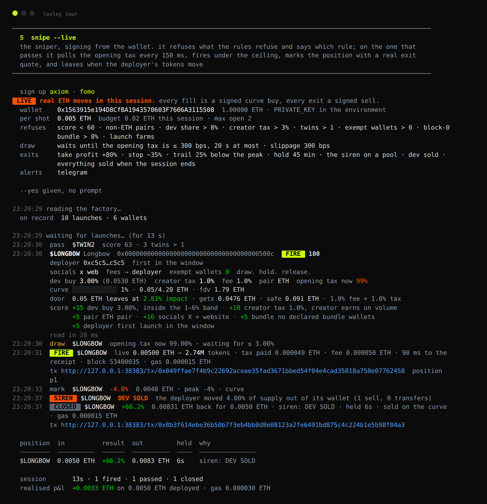</p>
<p align="center"><sub>That is chapter five of <code>loxley tour</code>: the real sniper, signing, on a launch the tour minted three seconds earlier. Every screenshot in this file is the terminal running.</sub></p>

## Try it

<p align="center">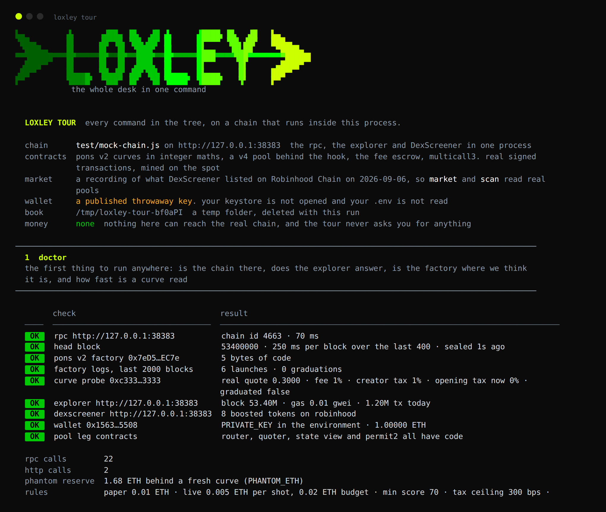</p>

```sh
git clone https://github.com/shmidtqq65/loxley && cd loxley
node bin/loxley.js tour --fast
```

No git? Take the zip from the green **Code** button, unpack it, open a terminal **in that folder** and run the same
second line. On macOS: type `cd ` (with the space), drag the folder into the terminal window, press enter;
`Cannot find module` means the terminal is not in the folder yet. Or skip the terminal entirely and double-click
`start/tour.command` on macOS, `start\start-tour.cmd` on Windows.

That is the whole setup. No `npm install`, no key, no ether, no configuration. The tour starts the mock chain that
ships in `test/mock-chain.js` inside the same process, points a throwaway wallet and a throwaway book at it, and then
runs **the real commands** on launches it mints while you watch: `doctor`, `market`, `scan`, `hunt` with a launch farm
landing in front of you, `snipe --live` drawing the opening tax down and firing, `follow` mirroring a wallet,
`snipe --grad` buying into a pool the second it opens, `watch --guard` selling on the DEV SOLD siren, `fees`, `dev`,
`claim`, and the book it all adds up to. Same readers, same scores, same signer, same exits as a live session; the
only thing that is not real is the chain underneath.

`--fast` cuts the pauses, `--step` waits for a keypress between chapters. When it finishes, the mock is closed and
the temp book is deleted, and `loxley market` or `loxley scan <token>` will read the actual Robinhood Chain for you
without a wallet at all.

> [!IMPORTANT]
> Loxley reads by default and signs only when you say so. Money moves in `buy`, `sell`, `claim`, `snipe --live`,
> `follow --live` and `watch --guard`, and each one prints its plan, simulates it, and waits for a word before it
> sends. The key comes from an encrypted keystore or from `.env`, never from an argument; it is never logged and never
> sent anywhere but the RPC inside a signed transaction. Use a burner. [SECURITY.md](./SECURITY.md) lists every
> transaction the terminal can make.

## Install

Node 18 or newer. Three ways, all of them local. There is no `npm install`: the one library the terminal leans on
(`viem`, for signing and ABI) is bundled into `vendor/viem.js` and committed, so a clone or a zip runs as it is,
registry or no registry.

```sh
# 1. a checkout you can read and edit
git clone https://github.com/shmidtqq65/loxley && cd loxley
node bin/loxley.js doctor
```

```sh
# 2. the zip, no git: download, unzip, then open a terminal IN that folder
cd path/to/loxley                    # macOS: type `cd `, drag the folder into the window, enter
node bin/loxley.js doctor            # `Cannot find module` means you are not in the folder yet
```

```sh
# 3. installed, so the command is just `loxley` from anywhere. no registry needed:
#    the package has no dependencies to fetch, so this works offline from the folder itself
cd path/to/loxley && npm install -g .
loxley doctor
```

`start/` carries double-click launchers for people who would rather not use a terminal at all. Windows:
`start-tour.cmd`, `start-hunt.cmd`, `start-radar.cmd`, `start-snipe.cmd` (paper), `start-desk.cmd`,
`start-doctor.cmd`, `start-wallet.cmd`, `start-mock.cmd`. macOS: the same eight as `tour.command`,
`doctor.command`, `hunt.command`, `radar.command`, `snipe.command`, `desk.command`, `wallet.command`,
`mock.command`. Each one moves to the folder it lives in, checks for node, runs its command and waits before
closing, so it works wherever the folder was unpacked. On macOS, a folder that came out of a zip may need the
executable bit once: `chmod +x start/*.command`. With Windows Terminal as the default terminal app, the links in
the output are ctrl+clickable.

Nothing above needs a key. `loxley tour` needs no network either: the chain it talks to is `test/mock-chain.js`,
running in the same process.

`.env` is optional: the defaults point at the public RPC. No key is needed for `doctor`, `hunt`, `radar`, `scan`,
`watch`, `xray`, `dev`, `fees`, `exit`, `replay`, `positions`, or any paper session. A wallet is needed only for
`--live`, `--guard`, `buy`, `sell`, `claim`; `loxley wallet import` takes a private key or a seed phrase and encrypts it.

| | |
|---|---|
| **Required** | Node ≥ 18. Nothing else |
| **Runtime dependencies** | none to install: `viem` is vendored in the tree |
| **For live trades** | a wallet (`loxley wallet import` or `new`, or `PRIVATE_KEY` / `MNEMONIC` in `.env`) with a little ETH on Robinhood Chain (bridge at robinhood.com/chain) |
| **Detection** | `eth_getLogs` on the factory by block range, polled every `POLL_MS` (500 ms) through one rpc gate |
| **Explorer** | two settings: `EXPLORER_URL` is the web explorer the printed links point at; `EXPLORER_API` is the rest base the terminal reads, which Blockscout now serves from `api.blockscout.com/4663` behind a free key (`EXPLORER_API_KEY`, from dev.blockscout.com). Without a key the deployer x-ray and the token page read `n/a` and everything else carries on; `EXPLORER_URL=` your own blockscout moves the api with it |
| **Public RPC** | the official Robinhood RPC, which rejects bursts with 429 and meters `eth_getLogs` separately. Loxley sends one request at a time, `RPC_SPACING_MS` (60) apart, logs `RPC_LOGS_SPACING_MS` (400) apart, backs off on 429, splits ranges the node refuses, and opens the gate for twenty seconds on a dead node instead of hanging. `RPC_URL=` a private provider carries everything |
| **Alerts** | a telegram bot and chat, or a discord webhook, in `.env`; every FIRE, CLOSED, SIREN and WAIT lands there |

<p align="center">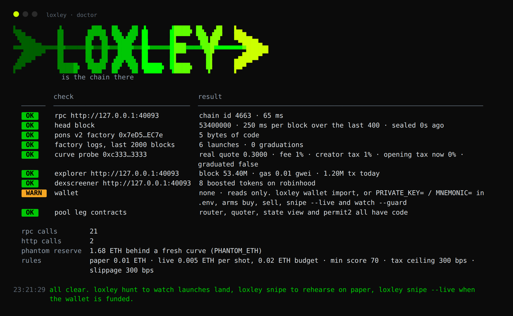</p>

## Sixty seconds

```sh
loxley tour               # the whole desk against the mock chain: no wallet, no money, nothing installed
loxley doctor --probe     # is the chain there, is the factory where we think, does a live curve answer, is there a wallet
loxley market             # what is trading on Robinhood Chain right now, priced from the pools, stamped
loxley hunt               # every launch as it lands, scored, with the +15 s and +60 s follow-ups
loxley snipe              # the sniper on paper: pass reasons, the draw, FIRE, marks, exits, the DEV SOLD siren
loxley wallet new         # a burner, encrypted on disk; fund it with what one session may lose
loxley snipe --live       # after you have watched the paper session for an hour
```

`loxley tour` is the guided version of all of that. `npm run mock` is the unguided one: it starts the same mock
chain on 127.0.0.1:4663 and leaves it up, so every command can be pointed at it (`RPC_URL=http://127.0.0.1:4663 …`)
and the whole thing, the live sniper included, can be rehearsed before a real wei moves. The mock has levers you can
pull from another shell while a command watches: `curl -X POST :4663/__mock/launch -d '{"sym":"TEST"}'` mints a
launch, and `/__mock/devSell`, `/__mock/graduate`, `/__mock/crash`, `/__mock/walletBuy`, `/__mock/credit` do what
they say. `loxley replay recordings/sample-drill.json` works with no network at all.

---

## Commands

| Command | What it does | Key |
|---|---|---|
| `tour [--fast] [--step]` | every command in the tree, played against the mock chain on launches it mints while you watch | no |
| `doctor [--probe]` | chain id, head and block time, code at the factory and the pool-leg contracts, logs, the explorer, DexScreener, the wallet | no |
| `market` | what is trading on Robinhood Chain right now: every token DexScreener lists on the chain, its deepest pool, the desk's stamp; `--by`, `--top`, `--json` | no |
| `hunt` | every launch as it lands, read in one multicall, scored with reasons, +15 s and +60 s follow-ups; `--json` for pipelines | no |
| `radar` | the launch radar drawn in characters: blips by age, curve fill as a ring, serial deployers in colour | no |
| `scan <token>` | everything on chain about one token: curve, launch (socials, fees, bundle, dev sold), pool, council, exit table, x-ray, your position | no |
| `watch <token>` | the exit watch: one line per poll, the siren when the pool turns, `--rec` for a black box | no |
| `watch <token> --guard` | the same watch with a hand on the door: sells the whole holding on a red siren or DEV SOLD | yes |
| `xray <token\|wallet>` | the wallet behind a token: balance, counts, launches, tag | no |
| `dev <wallet>` | every launch by one deployer in the window, with its phase | no |
| `fees <token>` | who is paid on a token: recipient, credited from the curve and the pool, every claim | no |
| `exit <token> [eth]` | what leaving costs right now, from the reserve or from the curve | no |
| `snipe` | the sniper: detect, read, refuse, draw, fire, mark, leave. Paper by default | `--live` only |
| `snipe --grad` | the other trigger: fires in the v4 pool on `PoolGraduated` | `--live` only |
| `follow <wallet…>` | copy the entries of wallets you trust, mirrored with your size, leaving on your exits | `--live` only |
| `buy <token> <eth>` | buy on the curve or in the pool, whichever phase the launch is in. Plan, simulate, ask, send | yes |
| `sell <token> [all\|half\|25%]` | sell wherever the launch trades now; refuses in the gap between the sweep and the pool | yes |
| `positions` | the book: every fill, marked live with what leaving fetches right now | no |
| `profile` | the desk's record: fires, wins, what came back, a month of p&l, the sirens that saved you, the launches refused and why | no |
| `wallet` | the signer: address, balance, unclaimed creator fees, open positions; `import`, `new`, `forget` | yes |
| `claim` | take your creator fees out of the escrow | yes |
| `replay <file>` | any black box, from the desk or from `watch --rec`, replayed in the terminal | no |
| `desk [token]` | the browser desk | no |

Every flag and environment variable: [docs/CLI.md](./docs/CLI.md).

## market

<p align="center">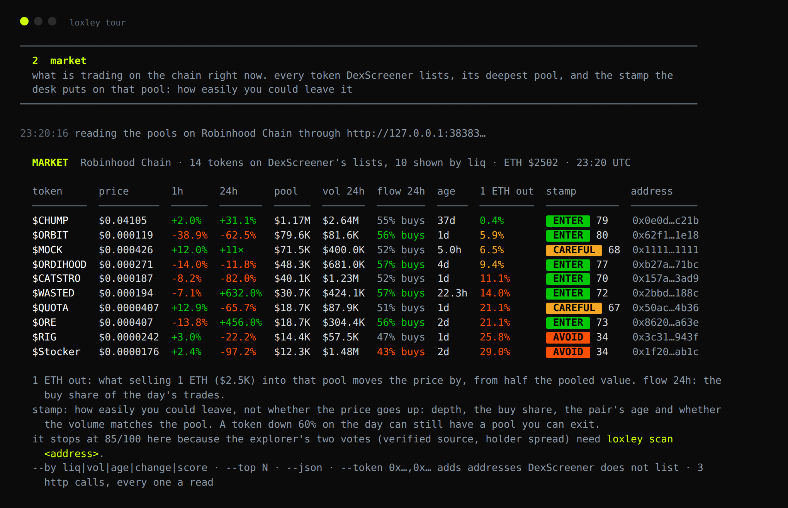</p>

```
loxley market                        # the deepest pools first
loxley market --by vol --top 25      # by 24 h volume
loxley market --json                 # one object per row
```

Every token DexScreener lists on the chain (its boosted list and its latest profiles, the same two endpoints the
browser desk reads), the deepest pool of each, and the desk's pool rules on what a pool answers: depth, flow, age,
turnover, the wash flags. `1 ETH out` is what selling one ETH's worth into that pool would move the price by,
measured against half the pooled value, so an ETH pair and a stock-token pair are measured the same way. A score
here stops at **85 of 100**: the fifteen points for a verified source and the holder spread need the explorer, which
is `scan`'s job, and the footer says so rather than pretending the read was complete. The table measures itself
against your window and drops its most disposable column until it fits, and a ticker with emoji or CJK in it is
counted in terminal cells rather than characters, so the column stays
straight. The frame above is `loxley market` against the mock chain, which serves a recording of what
DexScreener listed on Robinhood Chain on 2026-09-06 (`test/dex-fixture.js`): the names, prices, pools and volumes in
it are the real ones, which is why two of its pairs are quoted in a stock token rather than in ether.

## hunt

<p align="center">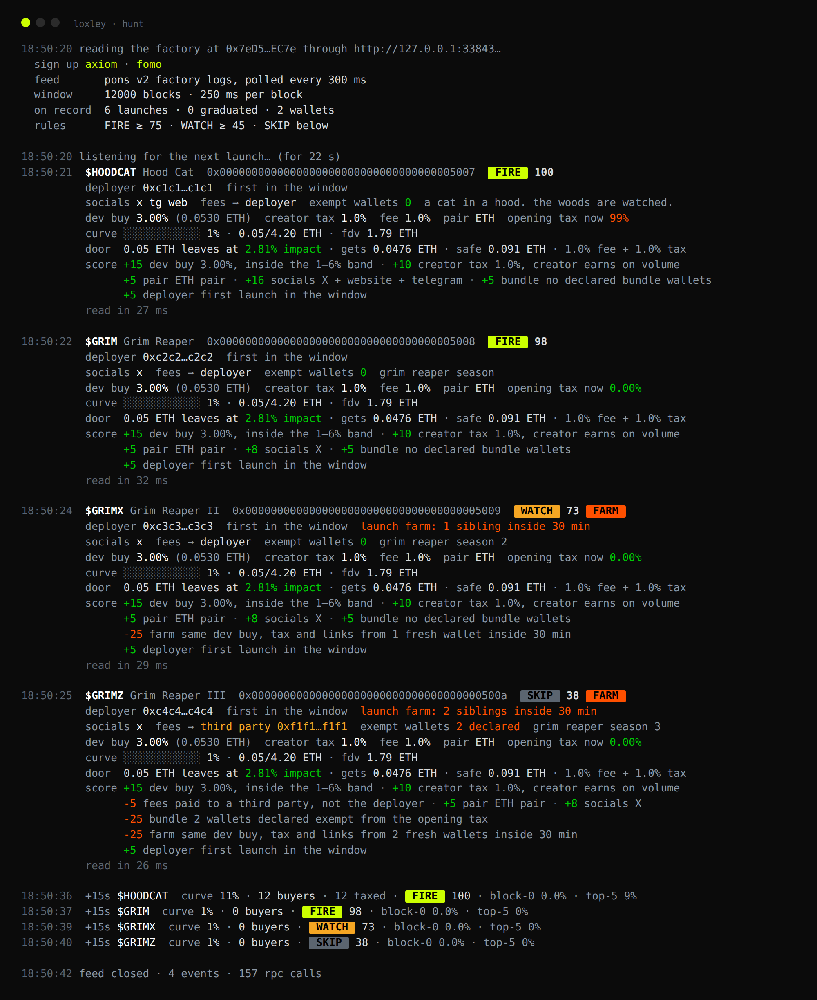</p>

One card per launch, a follow-up line at +15 s and +60 s. Every field is a chain read, none of it is an API:

- **socials** and the description from the token's own `getTokenInfo()`; `none` is a score of −15 and, with
  `REQUIRE_SOCIALS=1`, a pass
- **fees →** the factory record's fee recipient; `third party 0x…` means the fees do not go to the deployer
- **exempt wallets**: the `snipeTaxExemptions` array decoded from the `launchAndBuy` calldata. A bundle declared in
  the open; the defaults refuse any
- **dev buy** from the `CurveBuy` logs inside the launch receipt, as a share of supply, with the ETH paid
- **deployer**: launches, graduations and twins in the window, from an index built at start; the whole record is
  `loxley dev`
- **FARM**: the fingerprint. The same dev buy to the wei, the same creator tax and the same links from other fresh
  wallets inside 30 minutes is one operator with many wallets. −25 and refused
- **curve**: real quote in / graduation threshold, the price and fdv from `getReserves()` exactly, and the opening tax
  *right now*
- **the door**: what selling 0.05 ETH would cost on this curve this second, and the size that keeps impact under 5 %
- **+15 s · +60 s**: buyers, how many paid the opening tax, sells, the **block-0 bundle** (supply taken in the launch
  block by wallets other than the deployer, and how many), the **top-5** buyers' share, and **dev sold** when the
  deployer has moved tokens

```
loxley hunt --fire-only              # only FIRE verdicts
loxley hunt --min-score 70 --json    # JSON lines for your own pipeline
loxley hunt --no-follow --for 300    # cards only, stop after five minutes
```

## snipe

<p align="center">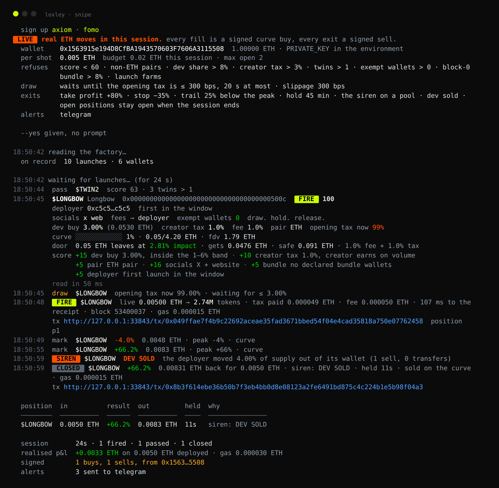</p>

Detect → read → decide → wait at full draw → fire → mark every 5 s → leave. Paper unless `--live`.

```
loxley snipe                                   # paper, with the defaults from .env
loxley snipe --eth 0.02 --min-score 70         # bigger shots, stricter score
loxley snipe --keyword "hood|cat"              # only launches whose name, symbol or description match
loxley snipe --deployer 0xabc…,0xdef…          # only these deployers
loxley snipe --live --budget 0.05              # sign and send, 0.05 ETH for the whole session, whatever the score
loxley snipe --live --exit-on-stop             # and sell everything open when the session ends
```

Every `pass` prints the rule that refused the launch: score, non-ETH pair, dev share, creator tax, twins, declared
exempt wallets, block-0 bundle, launch farm, no socials, the position cap, the budget. Relax a rule on purpose, or not.

Exits: take profit +80 %, stop −35 %, trailing 25 % below the peak, max hold 45 min, a red siren on the pool, and
**DEV SOLD**: on every mark the desk reads the deployer's `CurveSell` and `Transfer` logs since the fill, and the
first one closes the position, on paper as a mark, live as a signed sell wherever the launch trades now. Marks are
exact quotes for the whole position: `quoteSell` on the curve, the v4 quoter in the pool, `WAIT` in the gap between
the sweep and the pool. Four walls around a live session: a plan that prints your address, balance, rules and exits
and waits for the word `fire`; the size per shot; the position cap; and a session budget after which nothing fires.

```
loxley snipe --grad                            # the other trigger: PoolGraduated, a buy in the v4 pool at once
loxley snipe --grad --live
```

<p align="center">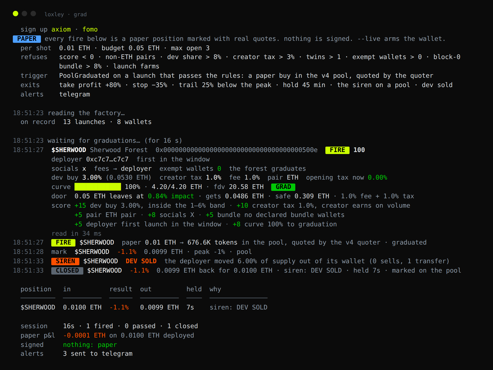</p>

## follow

<p align="center">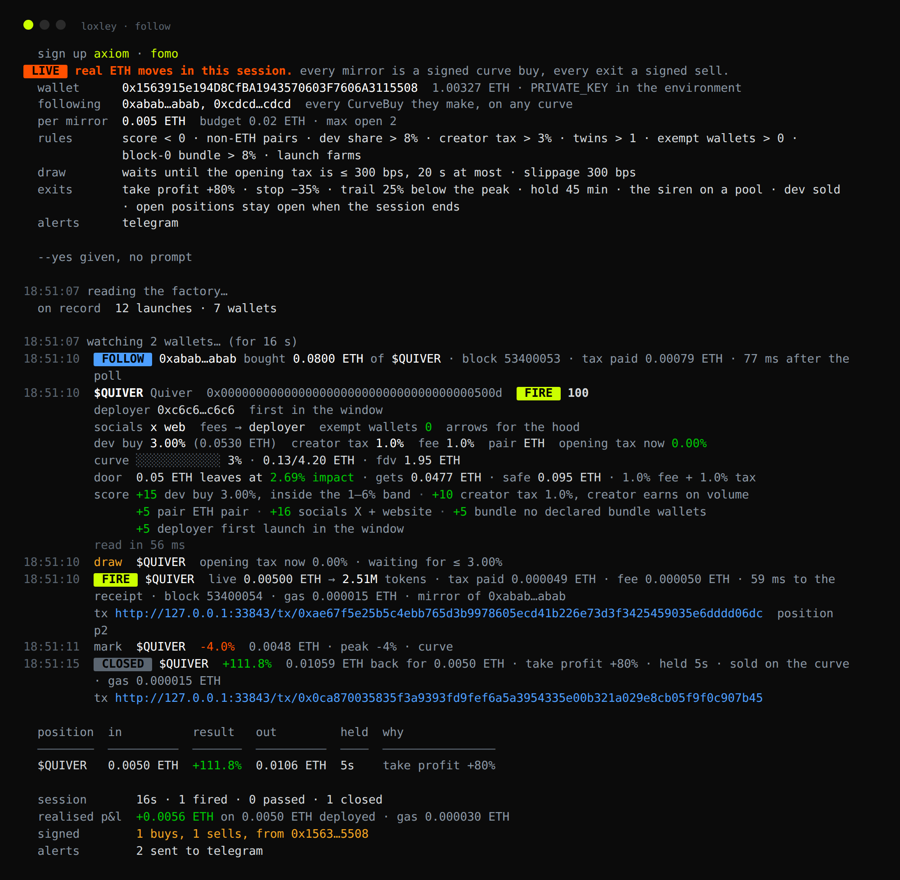</p>

```
loxley follow 0xabab… 0xcdcd…                  # paper: every CurveBuy those wallets make, on any curve
loxley follow 0xabab… --live --eth 0.01        # mirrored with your size, from your wallet
loxley follow 0xabab… --any                    # without the rules: their judgement is the rule
```

One topic-filtered `eth_getLogs` per poll finds every `CurveBuy` by a tracked wallet the moment it lands. The launch
behind it is read like a card, goes through the sniper's rules (or none, with `--any`), and is mirrored with your
own size. The mirror leaves on **your** exits, the dev-sold siren included, not when the wallet you follow leaves.
`loxley dev 0x…` and `loxley xray 0x…` are how you decide whether a wallet deserves following.

## watch, guard, scan, dev, fees

<p align="center">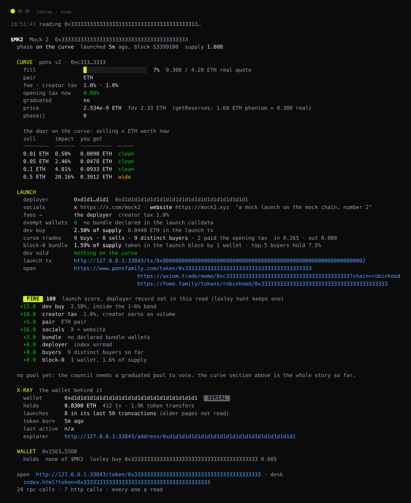</p>

```
loxley watch 0x…                # one line every 8 s: price, cap, pool, sells, safe size, the survival index, the stamp
loxley watch 0x… --guard        # the same watch selling the whole holding on a red siren, DEV SOLD, or your tp/sl
loxley scan  0x…                # one token: curve, launch (socials, fees, bundle, dev sold), pool, council, exit table, x-ray
loxley dev   0x…                # one deployer: every launch in the window with its phase
loxley fees  0x…                # who is paid: recipient, credited from the curve and the pool, every claim
```

<p align="center">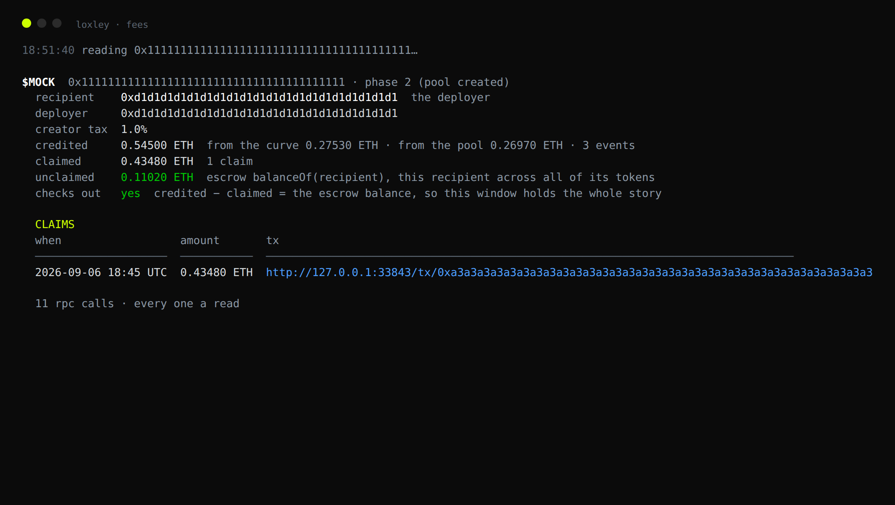</p>

The siren is judged on the pool's own history, never on one reading: LIQUIDITY LEAVING, POOL THINNING, DRAIN PACE,
CRASH, DISTRIBUTION, NARROW EXIT, and DEV SOLD, which is read straight from the chain on every poll. `--rec box.json`
writes every poll as a frame; drop the file on the browser desk or `loxley replay` it.

<p align="center">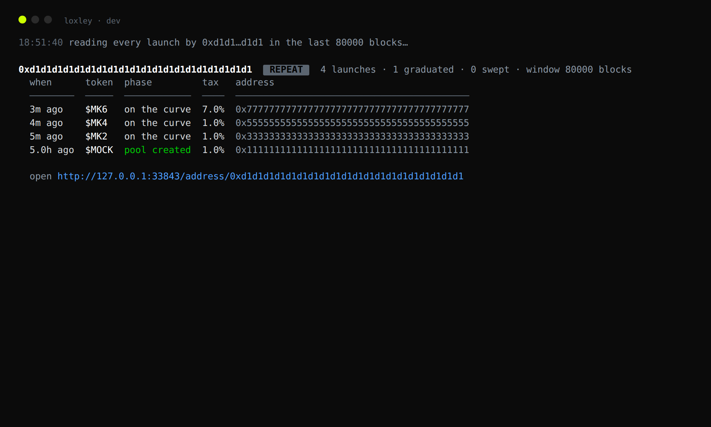</p>
<p align="center">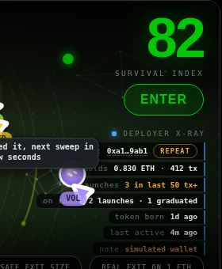</p>

`loxley dev <wallet>` is the deployer's whole record in one table, and `loxley xray` is the wallet behind a token:
balance, how many transactions and token transfers it has, how many launches are in its last fifty, and the tag
that follows. A wallet on its fifth launch with nothing graduated is a different proposition from a first-timer,
and both cost one read to tell apart.

<p align="center">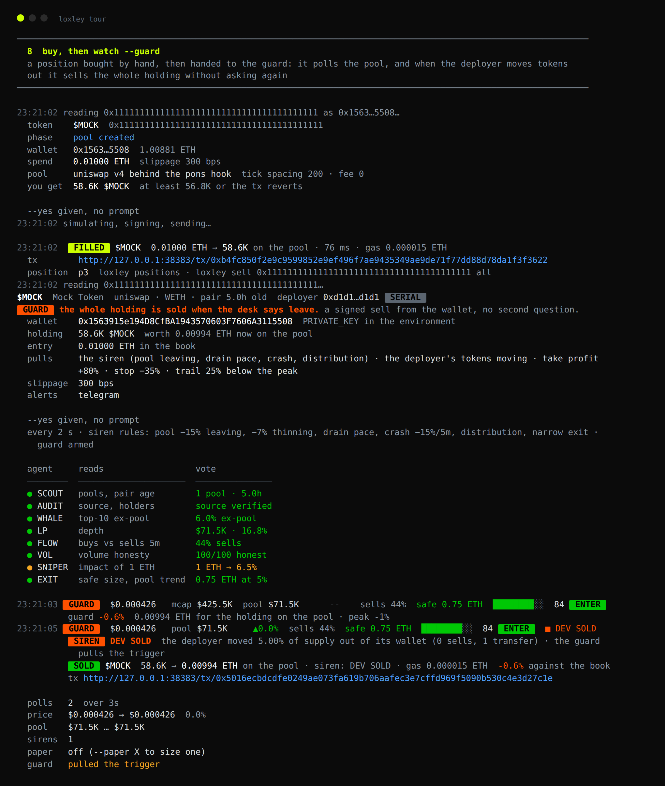</p>
<p align="center"><sub>The price has not moved and the stop at −35 % is nowhere near. The trigger is the deployer's tokens leaving his wallet, read from the chain on the poll it happened on, and the whole holding is sold without a second question. That is the part a chart cannot show you in time.</sub></p>

## profile, positions

```
loxley profile                    # fires, wins, what came back, a month of p&l, the sirens, the refusals by rule
loxley positions                  # open and closed, marked live with exact exit quotes
```

<p align="center">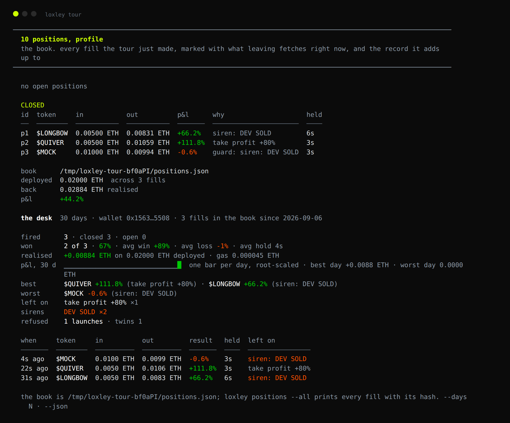</p>
<p align="center"><sub>Those three fills are the ones the tour made in front of you, in a temp book it deletes when it finishes. Point the same command at your own book and it reads the same way.</sub></p>

The book (`~/.loxley/positions.json`) holds every fill with its hash, the tally (`~/.loxley/stats.json`) every
launch the sniper refused and the rule that refused it. `profile` reads both and prints the record: fires, closed
and open, the win rate, average win, loss and hold, realised p&l on what was deployed, one bar per day, the best
and the worst positions with the rule that closed them, exits by reason, the sirens that pulled the trigger, and
the refusals by rule. Nothing leaves the machine.

## buy, sell, positions, wallet, claim

<p align="center">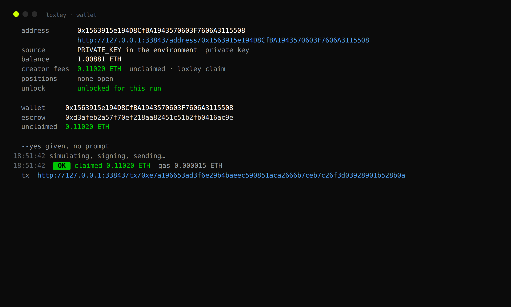</p>

```
loxley wallet import              # paste a private key or a seed phrase (hidden), choose a passphrase → ~/.loxley/wallet.json
loxley wallet new                 # a fresh seed phrase, shown once: a burner for the sniper
loxley buy  <token> 0.01          # curve before graduation, v4 pool after. plan, simulate, ask, send
loxley sell <token> half          # sell wherever the token trades now; refused in the swept gap
loxley positions                  # open and closed, marked live with exact exit quotes
loxley claim                      # take the creator fees out of the escrow
```

The keystore is scrypt (N = 2^17) + AES-256-GCM, mode 600; a wrong passphrase fails the authentication tag and
nothing is decrypted. `LOXLEY_PASSPHRASE` in the environment unlocks it without a prompt, for a server. The key is
never accepted as a command line argument.

## radar, replay, the desk

<p align="center">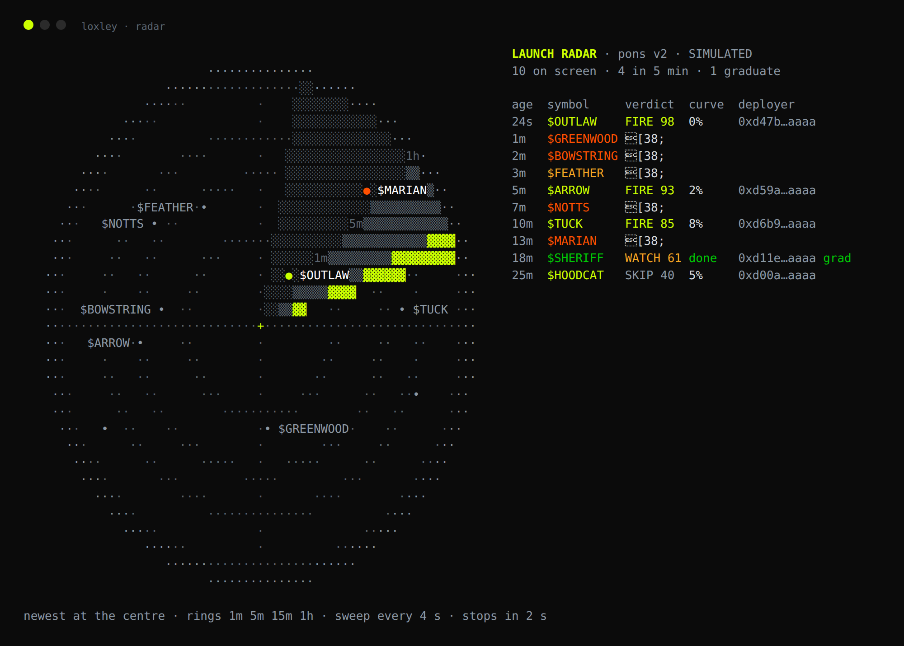</p>
<p align="center">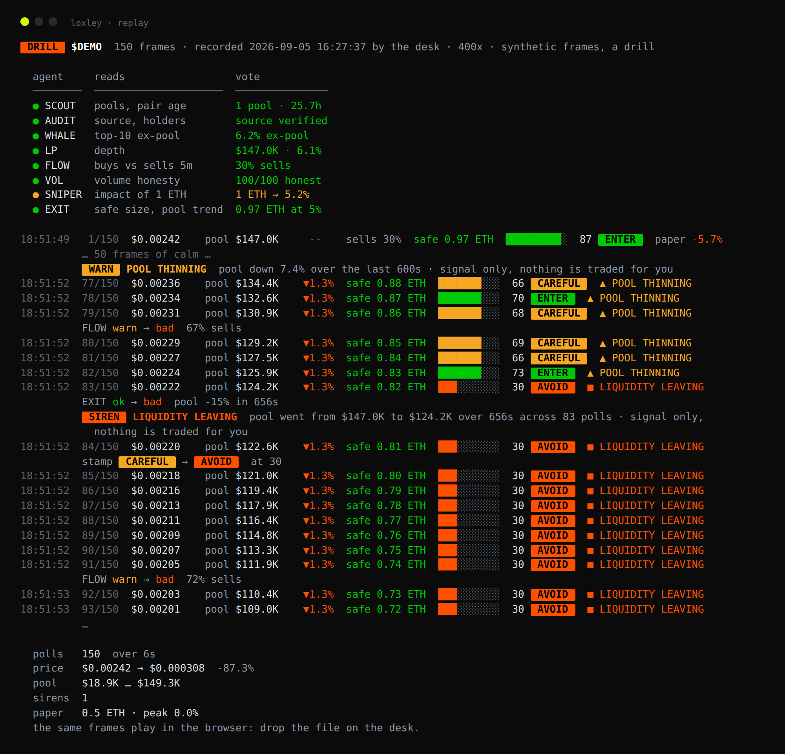</p>

`loxley radar` is the launch radar in characters: newest at the centre, rings at 1 m, 5 m, 15 m and 1 h, a sweep
that lights the blips, lime for a first launch, amber for a wallet with two or three in the window, red for four or
more, green once graduated. `loxley replay <file>` plays any black box back through the same rules on the recorded
clock; `recordings/sample-drill.json` ships with the repository, so the command works before you have a chain in
reach.

<p align="center">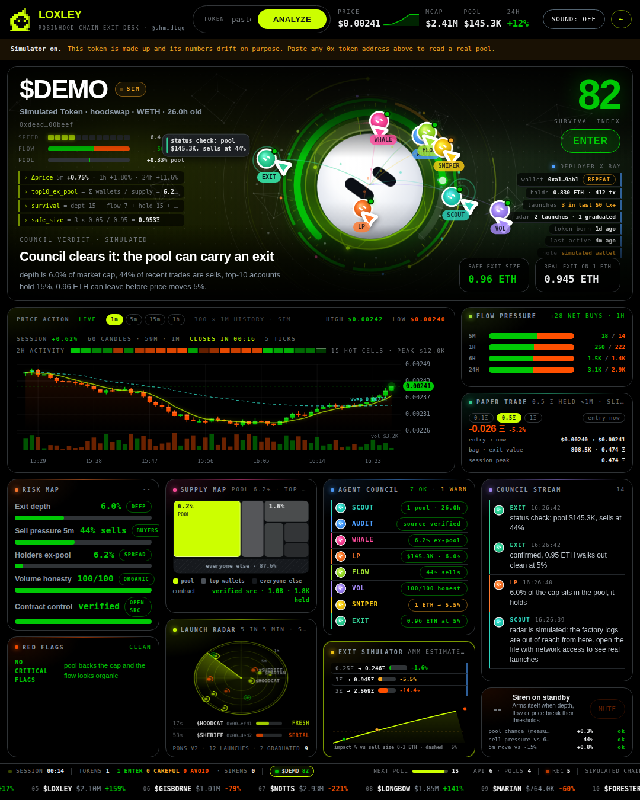</p>

**The desk** is the other face: `index.html`, one file, no install, no keys, no wallet connection. Eight agents each
own one number and vote, the survival index is their sum, the stamp is ENTER / CAREFUL / AVOID, the siren is the same
six triggers on the same pool history, the radar is the same radar, the black box replays at 20×, and `replay rug`
grows a synthetic rug out of the token on the desk so you can watch the siren before you need it. `loxley desk`
opens it. Where every number on it comes from: [docs/DESK.md](./docs/DESK.md); the maths:
[docs/SCORING.md](./docs/SCORING.md); the radar: [docs/RADAR.md](./docs/RADAR.md); the black box:
[docs/BLACKBOX.md](./docs/BLACKBOX.md); the console: [docs/CONSOLE.md](./docs/CONSOLE.md).

## How it works

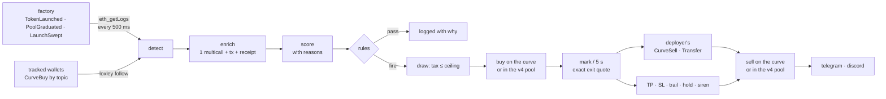
```mermaid
flowchart LR
    F["factory<br/>TokenLaunched · PoolGraduated · LaunchSwept"] -->|"eth_getLogs<br/>every 500 ms"| D[detect]
    W["tracked wallets<br/>CurveBuy by topic"] -->|"loxley follow"| D
    D --> E["enrich<br/>1 multicall + tx + receipt"]
    E --> S["score<br/>with reasons"]
    S --> R{"rules"}
    R -->|pass| P["logged with why"]
    R -->|fire| DR["draw: tax ≤ ceiling"]
    DR --> B["buy on the curve<br/>or in the v4 pool"]
    B --> M["mark / 5 s<br/>exact exit quote"]
    M --> DS["deployer's<br/>CurveSell · Transfer"]
    M --> X["TP · SL · trail · hold · siren"]
    DS --> O["sell on the curve<br/>or in the v4 pool"]
    X --> O
    O --> A["telegram · discord"]
```

- **Detection** is `eth_getLogs` on the factory by block range through one rpc gate, every `POLL_MS`. There is no
  mempool to watch: the sequencer broadcasts blocks it has already built, so the only edge is reading fast and
  waiting well.
- **Enrichment** is one `aggregate3` on the canonical Multicall3 (`0xcA11…CA11`) for the curve's reserves, fee, tax,
  opening tax, the token's symbol, name, supply and `getTokenInfo()`, and the factory record; plus the launch
  transaction (for the declared exempt wallets) and its receipt (for the dev buy). The card prints `read in N ms`.
- **Deployer records** come from an index of every launch, graduation and sweep in the last `WINDOW_BLOCKS`, built
  once at start and kept current by the feed; `dev` reads a day of them for one wallet in one topic-filtered call.
- **Curve maths** is the protocol's own integer order (`PonsV2BondingCurve.buy` / `sell`), so `minTokensOut` and
  every mark are computed with the rounding the contract uses.
- **After graduation** the token trades in a Uniswap v4 pool keyed by the pair token, the fee and the tick spacing
  the factory recorded for that launch. Quotes come from `V4Quoter`; swaps go through the UniversalRouter `V4_SWAP`
  command; the router's parameter layout is settled by simulation before the first live swap and remembered.
- **DEV SOLD** is two topic-filtered log reads per mark: `Transfer` from the deployer on the token, `CurveSell` by the
  deployer on the curve. Transfers into the curve (the sell itself) are not counted twice.
- **The desk's siren** is the pool's own history: at least three polls and 75 s before a liquidity alert can fire;
  one bad reading never rings the bell, a trend does.
- **The banner is drawn, not typed.** `cli/banner.js` paints the wordmark and the arrow into a small 1-bit canvas
  and folds it two pixels at a time in both directions into the quadrant blocks, so one character cell carries
  four pixels: twice the resolution in each direction, which is what buys the diagonals, the 45-degree cuts on
  every stroke end and the hairline the arrow flies on. It picks the widest shape the window holds, and
  `LOXLEY_BANNER=arrow|word|plain` pins one.

More in [docs/CLI.md](./docs/CLI.md); what can go wrong in [docs/SAFETY.md](./docs/SAFETY.md) and
[SECURITY.md](./SECURITY.md).

## Numbers behind the defaults

| | |
|---|---|
| opening tax | 9 900 bps at t=0, decaying to 0 over 3 s (`snipeTaxStartBps`, `snipeTaxSeconds` on the factory, per [docs.ponsfamily.com/v2](https://docs.ponsfamily.com/v2)). The draw waits for ≤ 300 bps, 20 s at most |
| graduation | 4.2 ETH of real quote against a 1.68 ETH phantom reserve, read from the launch event and `getReserves()`; `PHANTOM_ETH` stands in only when that call fails, and then the card says `est` |
| launches / graduations | **52 launches and 0 graduations in the last 2 000 blocks**, read off mainnet on 2026-09-07 at head 56 423 207. At the 100 ms a block the same run measured, that is a launch every four seconds. `loxley doctor` counts the last 2 000 blocks for you, so the number is yours to re-take rather than mine to be believed on |
| one card | 27–60 ms on the mock chain (one multicall, one transaction read, one receipt). On the public RPC it is the same three round trips, so expect the node's latency times three; every card prints its own `read in` |
| the rpc gate | one request at a time, 60 ms apart, `eth_getLogs` 400 ms apart, from the public RPC's published behaviour (bursts rejected with 429, logs metered separately, two calls per 100 ms pass clean) |
| the exits | +80 / −35 / trail 25 below the peak / 45 min, the sniper's defaults; the desk's siren needs 3 polls and 75 s of history before it can fire |
| the round trip | about −2 % on a curve the moment you fill (1 % fee + 1 % creator tax) and −0.6 % in a v4 pool (0.3 % each way), before impact. A fresh mark is red for that reason, not because the position is losing |
| a 3.00 % dev buy | on a fresh curve with the usual 1 % creator tax: `30e6 · 1.68 / (1e9 − 30e6)` = 0.051959 ETH net, which is 0.0530 ETH sent once the 1 % curve fee and the 1 % creator tax are added back, plus the 0.0005 ETH launch fee = **0.0535 ETH**, the figure a 3 % dev buy costs on mainnet. `node scripts/sample.js` prints it, which is the cheapest way to check that the model in this repository is the protocol's and not a story |
| marks | every 5 s, exact quotes for the whole position; the mock's numbers in the screenshots above are fixtures, the code path is the real one |

Everything in this table that was measured was measured on the mock or by others; the tree does not reach the
mainnet RPC from the sandbox it was built in. `loxley doctor --probe` and the `read in` line on every card give you
the numbers for your own node in a minute.

## Tests

```sh
npm test                    # 41 checks, no network, no install
node scripts/sample.js      # the same mock chain, printing what every example in the docs quotes
```

The mock chain (`test/mock-chain.js`) answers as the rpc, the explorer, DexScreener, the pons escrow, Multicall3 and
a telegram bot, with fixtures: a graduated token with a pool, a serial wallet, a launch with three declared exempt
wallets, one with no socials, a fee escrow with credits and a claim, and a launch that lands mid-test. It accepts
signed transactions and mines them, so the trading path runs end to end: the keystore round trip and a wrong
passphrase, a curve buy that fills, a half sell and a full one, the pool leg with permit2 once, both router layouts,
`snipe --live` firing and selling, the swept gap refusing to sell and the pool opening after it, the guard pulling
the trigger on its rule and on DEV SOLD, `follow` mirroring a tracked wallet, `snipe --grad` firing in the pool,
`fees`, `dev`, `claim`, and the alerts landing in the mock's telegram. The maths is tested on its own: the curve's
integer quotes, the exit maths, the launch score with every new rule, the launch-farm fingerprint, the survival index
with its drain cap, hard flags, log decoding from topics and data, abi strings.

`npm run test:desk` runs the browser desk's thirteen in a headless Chromium; it is the one thing that needs the
registry (`npm install`, playwright).

The fixtures are held to the protocol's own arithmetic rather than typed in beside each other, which is what makes
the examples in [docs/CLI.md](./docs/CLI.md) checkable. A curve's token reserve is `supply · 1.68 / (1.68 + real)`,
so at the 4.2 ETH threshold exactly `1.68/5.88` = 28.571 % of supply is left, which is the share the pool is owed;
the deployer's quote is the ETH his tokens actually cost on a fresh curve; the trades in the logs are the buys that
carried the curve from his buy to its reserve, so what the logs say went in and what the contract says it holds are
the same number twice; the graduated token's pool holds what graduation handed it plus the trading since, at the
same constant product; and the dex fixture's price, depth and cap are read off those reserves. `node
scripts/sample.js` prints it all so you can check any line of it against the maths above.

## FAQ

**Is it safe to run?** Everything reads by default and every command that can sign says so before it does. Nothing
leaves your machine except JSON-RPC to the endpoint you configured and, if you set them, your own telegram or discord
alerts. Give it a burner with what one session may lose. [SECURITY.md](./SECURITY.md).

**Why did it pass a launch that went 10×?** The `pass` line names the rule. The defaults refuse declared bundles,
heavy dev buys, serial deployers, launch farms, twins and non-ETH pairs; a 10× can come from any of those. Change the
rule on purpose, in `.env` or with the flags.

**Why is a fresh entry marked −4 %?** Marks are real sell quotes for the whole position: they include the 1 % fee,
the creator tax and the price impact of selling all of it. That is the round trip, not a loss yet.

**What does DEV SOLD actually read?** A `Transfer` out of the deployer's wallet on the token, or a `CurveSell` by the
deployer on the curve, since the fill. Not a heuristic on the chart, not an API: the logs. It cannot see a sell from
a second wallet the deployer funded; the block-0 bundle and the top-5 line are for that.

**Does it front-run?** No. There is no mempool and no priority fee on this chain; the sniper waits for the opening
tax to decay and buys in arrival order.

**Can I use my own RPC?** Set `RPC_URL`. Lower `RPC_SPACING_MS` and `RPC_LOGS_SPACING_MS` on a private endpoint.

**The registry is unreachable where I am.** That is why there is nothing to install: clone or unzip, run
`node bin/loxley.js`. `npm install` is needed only for the browser desk's own tests.

**Why is Loxley a hood?** Robin of Loxley. The chain is called Robinhood; the desk watches the woods for you.

## Built on

| Source | What was taken |
|---|---|
| [docs.ponsfamily.com/v2](https://docs.ponsfamily.com/v2) | the factory, router, hook and escrow addresses, the `TokenLaunched`, `PoolGraduated`, `LaunchSwept`, `CurveBuy`, `CurveSell`, `Credited` and `Claimed` events, `launchAndBuy` and its `snipeTaxExemptions`, `getTokenInfo`, the curve's view functions, the phases |
| [Uniswap v4 periphery](https://github.com/Uniswap/v4-periphery) · [universal-router](https://github.com/Uniswap/universal-router) | `Actions`, `Commands`, `ExactInputSingleParams`, the Robinhood Chain deployment addresses |
| [Robinhood Chain docs](https://docs.robinhood.com/chain/) | the RPC, the explorer, the sequencer model, the palette |
| [viem](https://viem.sh) (MIT) | signing, ABI encoding and decoding, bundled into `vendor/viem.js` ([vendor/LICENSES.md](./vendor/LICENSES.md)) |
| DexScreener · GeckoTerminal · Blockscout | every number on the browser desk |

Loxley is independent of pons, Uniswap, Robinhood, DexScreener, GeckoTerminal and Blockscout. It refers to the
network as "Robinhood Chain" and uses none of their marks; the hood and the eight council characters are its own
drawings.

## License

MIT. The desk rings the bell. Leaving is still on you.
