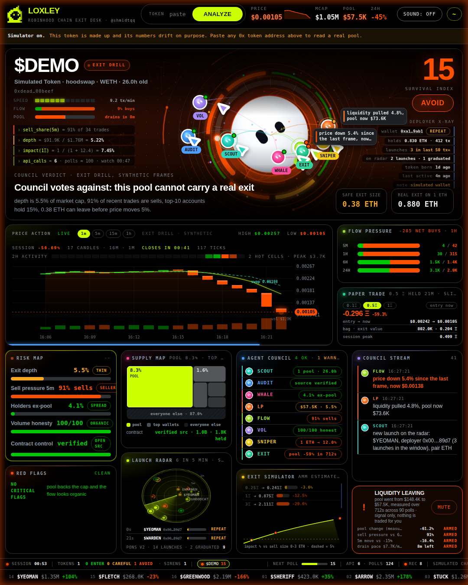

# Black box, replay and the exit drill

<p align="center"></p>

## Recording

Every poll the desk completes on a token becomes a frame:

```json
{ "t": 1757080000000,
  "pair":  { "...": "the DexScreener pair exactly as it was returned" },
  "chain": { "...": "the explorer's supply, holders, verification, as last read" } }
```

Frames go into an in-memory list, one per token; loading another token starts a new list. The list holds up to 2 400
frames, which at one poll every eight seconds is about five hours. The status bar counts frames (`rec`). Nothing is
written to disk until you ask.

## Replay

`replay` plays the black box back through the very same code path that scored it live. Each frame becomes the current
pair, the metrics are recomputed, the council re-votes, the survival index is re-summed, the siren re-evaluates the
pool history it has seen **so far**, the chart pushes the frame's tick under the recorded timestamp. Nothing is
pre-baked; a replay can surprise you.

| | |
|---|---|
| `replay` | 20× |
| `replay 40` | any speed from 1 to 400; a frame every `8000 / speed` ms, clamped between 80 ms and 2.5 s |
| `stop` | freeze on the current frame |
| `live` | back to the live feed for the token, or the simulator if the recording was one |

While a replay runs the badge says REPLAY, the verdict header says replay of recorded frames, the chart shows a blue
progress bar under the candles and its header says black box. The chart keeps the GeckoTerminal history it already
had, so recorded ticks land in their real minutes.

## Export and import

`export` downloads the black box as `loxley-<symbol>-<date>.json`:

```json
{ "loxley": 1, "version": "1.0.0", "chain": "robinhood",
  "mint": "0x…", "symbol": "…", "kind": "recording",
  "recorded": "2026-09-05T13:00:00.000Z",
  "frames": [ … ] }
```

Drop that file anywhere on a loxley desk, or type `import` and pick it, and it replays at 20×. The desk does not need
a token loaded, or a network, to replay a file. That is how a rug you watched becomes something you can hand to
someone: the file, not a screenshot.

`recordings/sample-drill.json` in this repository is one such file, made by the desk itself with `replay rug` and
`export`.

## Exit drill

`replay rug` (or `drill`) does not need a recording. It takes the pair currently on the desk and grows 150 synthetic
frames out of it, eight seconds apart, ending now:

| Frames | Phase | Pool per frame | Price per frame | Sells |
|---|---|---|---|---|
| 1 – 69 | calm | ±0.3 % | ±1 % | ~45 % |
| 70 – 107 | drain | −1.3 % | −1.0 % | ~70 % |
| 108 – 134 | dump | −4.8 % | −5.4 % | ~88 % |
| 135 – 150 | dead | −1.5 % | −1.5 % | a handful of trades |

Market cap follows price, the ETH reserve follows the pool, `priceChange` and five-minute volume follow the phase. The
holder book is the one the desk had. The chart history is cleared so the candles show only the drill's own timeline.

Everything about the drill says so: the badge reads EXIT DRILL, the verdict header reads exit drill, synthetic frames,
the chart header reads exit drill · synthetic, the stream announces it, and an exported drill carries
`"kind": "drill"`. `live` returns to the feed, and the black box of the real session is untouched: the drill never
records over it.

At 20× the drill takes about a minute; at 30× about fifty seconds. `?replay=rug&speed=30` in the URL runs it seven
seconds after the token loads, for filming.

## What a replay does not replay

The council stream's chatter is generated live from the current numbers, so the lines differ from the original
session. Transfers (the pulses into the core) are not recorded. Exit quotes are recomputed from the reserve in each
frame, which is what they were live.
