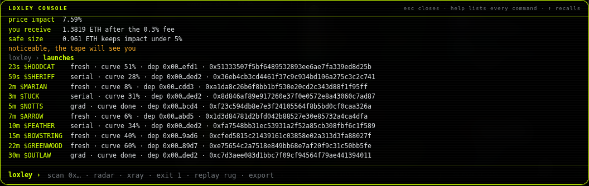

# Console

A command line over the desk. `~` (or the button top right) opens it, `esc` closes it, `↑` and `↓` recall, `tab`
completes a command, `?console=1` in the URL opens it on load. Output stays until `clear`.

The console does not have its own engine: every command reads or drives the same state the panels show. Nothing in it
can send a transaction.

## Loading

| Command | Does |
|---|---|
| `scan 0x…` | load a token. `analyze`, `load` and `watch` are the same; a bare address on its own line is a `scan` |
| `demo` | the simulator: a made-up token that drifts, then rugs |
| `live` | leave a replay and go back to the live feed |
| `open` | explorer, DexScreener, GeckoTerminal and pons links for the loaded token |

## Reading

| Command | Does |
|---|---|
| `council` | every agent's vote with the number behind it, and the survival index with the stamp |
| `score` | the survival index part by part: depth, flow, holders, contract, age, turnover, penalties, caps, hard flags |
| `exit <eth>` | what selling that much costs right now: pool reserve, price impact, what you receive after the 0.3 % fee, the size that keeps impact under 5 %, and a verdict line |
| `xray` | the deployer report: wallet, tag, holdings, launches in its last 50 transactions, launches on the radar, token age, last activity, explorer link |
| `launches` | the ten newest launches on the radar: age, symbol, tag, curve fill, deployer, address |
| `pulse` | the latest transfers the explorer has shown for the token |
| `log` | every token this session with its last stamp and score |
| `status` | mode, token, session clock, polls, API calls, sirens, black box frames, radar state |

## Driving

| Command | Does |
|---|---|
| `radar [big\|card]` | swap the launch radar into the core's seat, or back; without an argument it toggles |
| `paper <eth>` | size of the paper position (any number, the three buttons are 0.1, 0.5 and 1) |
| `tf 1m\|5m\|15m\|1h` | chart timeframe |
| `sound [on\|off]` | beeps and the siren; without an argument it toggles |
| `mute` · `unmute` | the siren's sound only; the red frame stays |

## Black box

| Command | Does |
|---|---|
| `rec` | how many frames the black box holds and how old the first one is |
| `rec clear` | wipe it |
| `replay [speed]` | play the black box back, 20× by default, 1 to 400 |
| `replay rug [speed]` · `drill [speed]` | the exit drill grown from the loaded token |
| `stop` | freeze a replay on the current frame |
| `export` | download the black box, or the running replay, as json |
| `import` | pick a json recording to play; dropping the file on the desk does the same |

## Housekeeping

| Command | Does |
|---|---|
| `help` · `?` | the command list with one line each |
| `clear` | wipe the console |
| `about` | what this is |
| `cli` | how to run the same desk in a terminal ([CLI.md](./CLI.md)) |

## Colours

Lime is the command you typed, green is a result, amber is a warning or an incomplete argument, orange is an error
or a bad number, grey is commentary. Tables are two columns, key and value.
