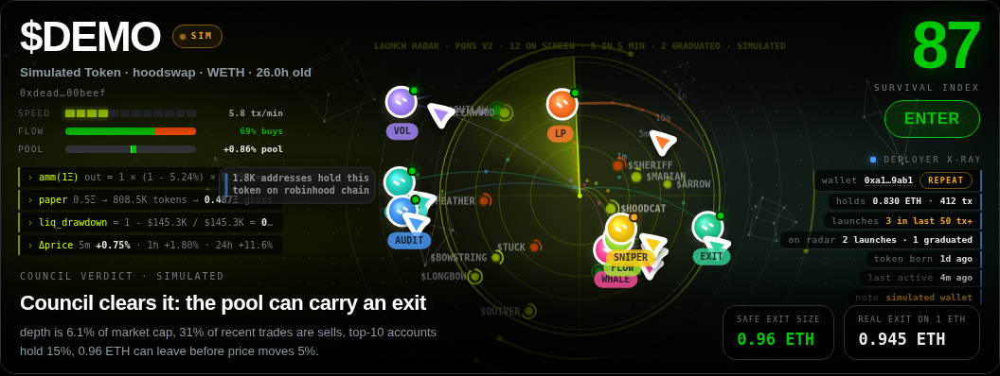

# Launch radar

<p align="center"></p>

The radar shows every pons v2 launch on Robinhood Chain that the factory has emitted in its recent logs, as a blip.
Newest at the centre. It exists so that the desk sees a launch the moment the chain does, before any API has a name
for it.

## Where the launches come from

The pons v2 factory at `0x7eD598BcEf8bd9Edd8C97A195C6d13f40801EC7e` emits one log per launch:

```
TokenLaunched(address indexed token, address indexed curve, address indexed deployer,
              address pairToken, uint256 launchConfigId, uint256 graduationThreshold)
```

and one per graduation:

```
PoolGraduated(address indexed token, bytes32 poolId)
```

Every ten seconds the desk asks the explorer for the factory's latest logs (`addresses/<factory>/logs`) and decodes
each one from its topics and data: `topics[0]` is the event's keccak, `topics[1..3]` are the token, the curve and the
deployer, the data holds the pair token, the launch config and the graduation threshold. The explorer's own decoding
(`decoded.parameters`) is used as a cross-check when present. If the explorer is unreachable the desk asks the chain
directly with `eth_getLogs` over the last 2 400 blocks, with both event topics in the filter.

Keccak topics, if you want to check them:

```
TokenLaunched(address,address,address,address,uint256,uint256)
0x8d4aad4953d0ca700d468f3753aa14432d1b35b43ec6409f051fb6aa43a89607
PoolGraduated(address,bytes32)
0xd85d014567e903c654d1018dbc03f19e3aa57fcb38adb266462ed085b2f37d12
```

## Time

Explorer logs carry a block number, not a timestamp. The desk keeps a head from `blocks` (height, timestamp, and the
average block time over the page) and estimates a launch's age as `(head − block) × blockTime`. For the newest eight
blips it then fetches the block itself (`blocks/<n>`) and replaces the estimate with the block's timestamp.

## Names

A fresh mint has no name anywhere for a few seconds. The desk asks the explorer (`tokens/<token>`) for symbol, name,
icon and holder count, two at a time, and when the explorer has nothing yet it calls `symbol()` and `name()` on the
token itself through the RPC. Blips without a name show `$…` until one arrives; a token the explorer never indexes is
retried four times, fifteen seconds apart, then left as is.

## Curve fill

Every ten seconds, for the ten freshest curves that have not graduated, the desk calls `realQuoteReserve()`
(`0x4f1f58fd`) on the curve and divides by the launch's `graduationThreshold`. That ratio is the ring around the blip
and the bar in the list. Calls are spaced 140 ms apart so the public RPC never answers 429.

## Reading the radar

| Mark | Meaning |
|---|---|
| distance from the centre | age, on a log scale: rings at 1 m, 5 m, 15 m and 1 h; a blip fades out after an hour |
| angle | fixed per token, from its address, so a blip never jumps |
| lime blip | a wallet with one launch in the window |
| amber blip · REPEAT | the deployer has two or three launches in the window |
| orange-red blip · SERIAL | four or more |
| green ring · GRAD | `PoolGraduated` seen for this token; a pool exists and the desk can read it |
| blue blip | the pair token is not ETH (USDG, a stock token) |
| ring around a blip | curve fill toward graduation |
| flash | a launch or a graduation that just arrived |
| sweep | passes every four seconds and lights the blips it crosses |

The card in the second column shows the newest two launches under the radar with age, symbol, curve fill and tag, and
counts launches, graduations and distinct wallets in the window (the last 48 launches the factory emitted). `radar`
in the console swaps the radar into the core's seat at full size; the council keeps orbiting around it.

## Clicking a blip

A graduated token loads onto the desk like any pasted address. A token still on its curve has no pool, so there is
nothing for the council to read: the desk says so in a banner and in SCOUT's stream, puts the address in the token
field, and keeps watching its ring. Load it after graduation.

## Sound

With sound on, a new launch is a short high beep and a graduation a lower one.

## Simulated radar

If the factory logs cannot be reached at all (a sandboxed preview, a blocked network), the radar switches to made-up
launches, says `simulated` on the card, and adds a made-up launch every twenty seconds so the visuals keep moving. It
never labels a simulated launch as real.
